# Digital Forensics and Incident Investigation

  

## Objective
The primary objective of this project was to conduct a comprehensive digital forensic investigation into a suspected Intellectual Property (IP) theft. The goal was to identify unauthorized data exfiltration, preserve evidence integrity through forensic best practices, and provide actionable security recommendations to senior management to harden the environment against future internal threats.

## Key Achievements

* Identified and recovered deleted proprietary images and confidential business strategy documents from unallocated disk space using Autopsy.

* Established evidence integrity by documenting a strict Chain of Custody and utilizing SHA-256 hashing for data authentication.
  

* Uncovered suspicious user activity by analyzing web history for evidence of financial harm, including searches related to hiding Bitcoin transactions.
  

* Authored a comprehensive forensic report summarizing critical findings and providing non-technical roadmaps for legal action and risk mitigation.

* Constructed a chronological timeline of malicious activity using forensic bookmarking to demonstrate the start and progression of data theft.

## Skills & Tools

* Forensic Software: Autopsy (Full Disk Autopsy, Disk Image Analysis, Ingest Modules).

* Incident Response: Evidence Collection, Chain of Custody, Forensic Artifact Preservation.
  

* Network & Data Analysis: Wireshark (Traffic Analysis), SHA-256 Hashing, Web History/Metadata Investigation.
  

* Technical Communication: Generating non-technical investigative plans and management-ready forensic summaries

## 🕵🏾 Phase 1: Case Initialization & Evidence Acquisition

* Initialized a new forensic case titled Smith_John_Investigation within the Autopsy environment to maintain structured evidence management.

* Secured the investigation directory in a dedicated path to prevent accidental data modification and ensure evidence preservation.

* Documented examiner credentials and contact information to establish a formal Chain of Custody record for all personnel handling the evidence.

* Acquired the data source by selecting the disk image file JSmith_Q1.001 for deep-drive analysis into the suspected Intellectual Property (IP) theft.

<table>
  <tr>
    <td align="center"><b>Step 1: Create Forensics Case</b> 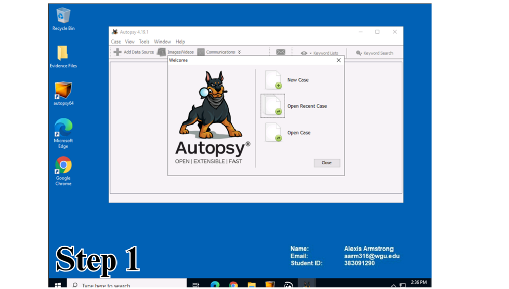 <i>Initializing Smith_John_Investigation in Autopsy</i></td>
    <td align="center"><b>Step 2: Case Information</b> 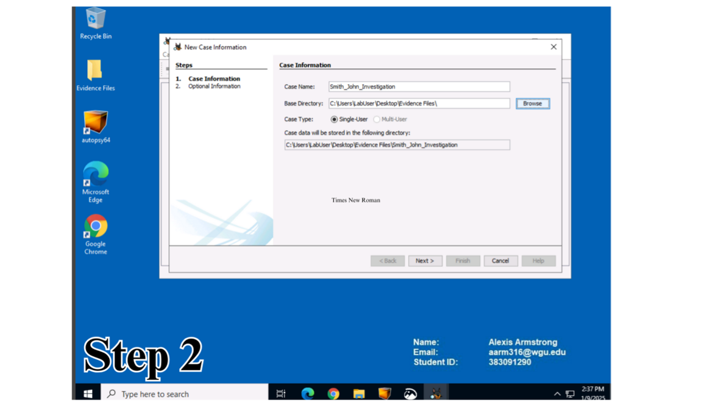 <i>Naming case and storing in dedicated directory</i></td>
  </tr>
  <tr>
    <td align="center"><b>Step 3: Examiner Details</b> 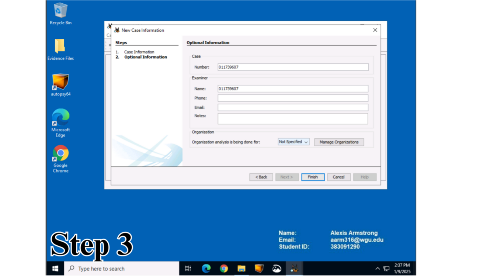 <i>Documenting examiner for Chain of Custody</i></td>
    <td align="center"><b>Step 4: Data Source Selection</b> 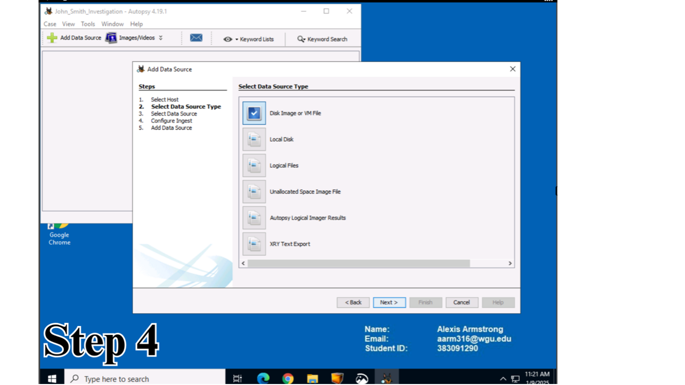 <i>Selecting disk image or VM file</i></td>
  </tr>
  <tr>
    <td align="center"><b>Step 5: Load Data Source</b> 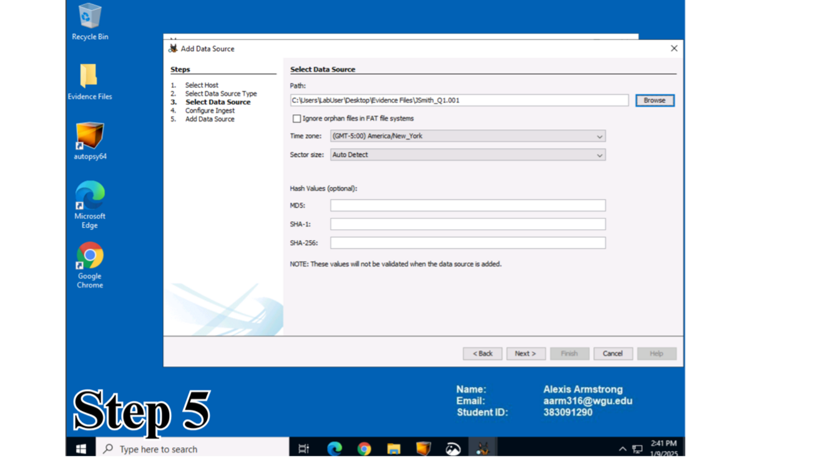 <i>Utilizing JSmith_Q1.001 as the data source</i></td>
    <td align="center"><b>Step 6: Configure Ingest</b>  <i>Using Autopsy default ingest modules</i></td>
  </tr>
  <tr>
    <td align="center" colspan="2"><b>Step 7: Start Analysis</b> 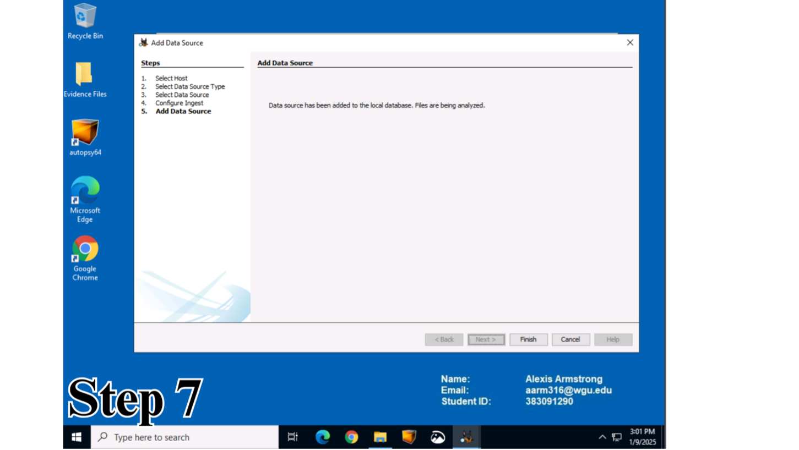 <i>Ingest process completion and start of analysis phase</i></td>
  </tr>
</table>

## 🫆 Phase 2: Evidence Analysis & Identification

* Executed the ingest process using standard forensic modules to parse the data source and prepare for the analysis phase.

* Analyzed system artifacts to identify and extract relevant evidence, focusing on confidential files, proprietary images, and communication records.

* Recovered deleted confidential files from the subject's machine, including business strategy and drilling methodology documents owned by authorized personnel.

* Identified proprietary images related to critical infrastructure, such as reverse osmosis processes and building structures, indicating a policy violation.

<table>
  <tr>
    <td align="center"><b>Step 8: Artifact Analysis</b> 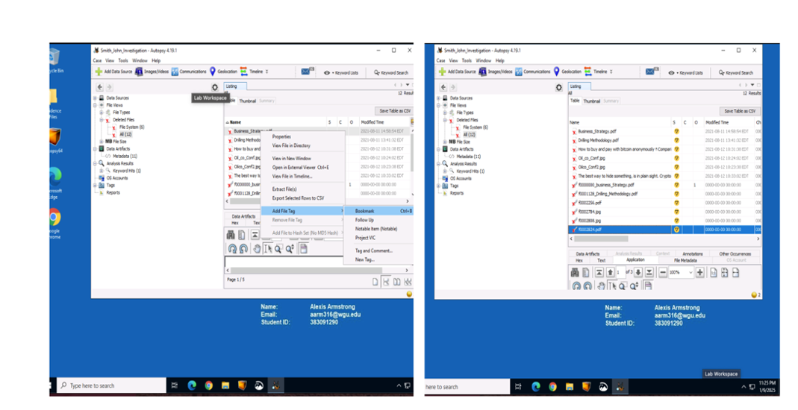 <i>Discovering 11 suspicious files on subject machine</i></td>
    <td align="center"><b>Step 9: Deleted File Investigation</b> 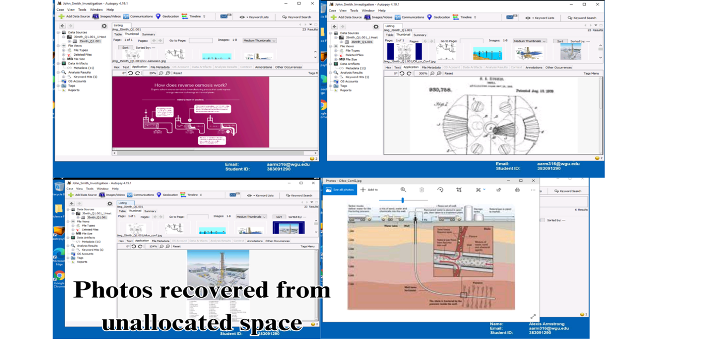 <i>Analyzing unallocated space for PDF and JPEG artifacts</i></td>
  </tr>
  <tr>
    <td align="center"><b>Step 10: Timeline Generation</b> 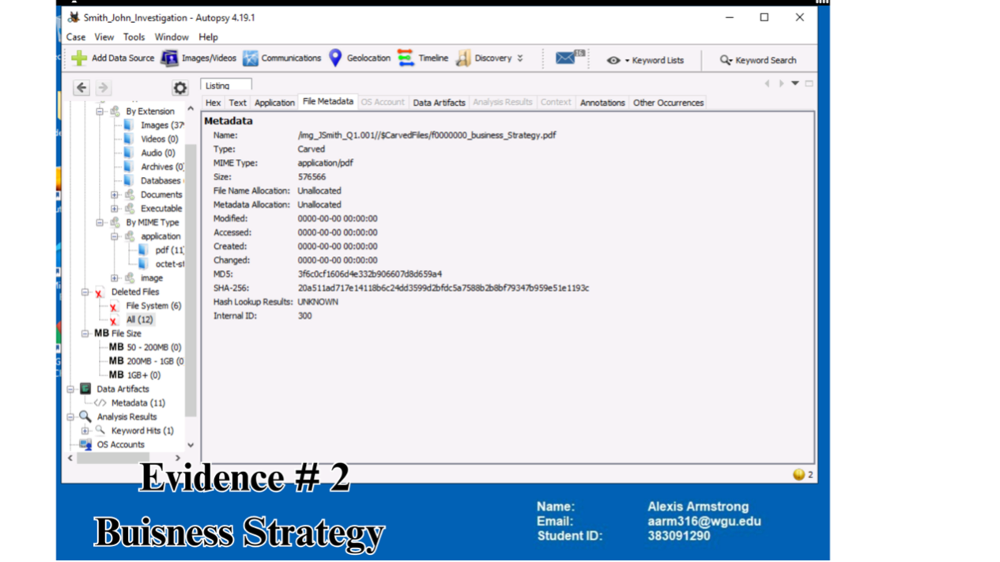 <i>Utilizing bookmarking to create chronological event map</i></td>
    <td align="center"><b>Step 11: Proprietary Data Recovery</b> 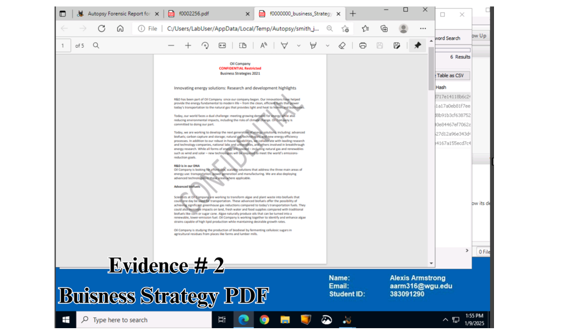 <i>Recovering 4 proprietary photos related to operations</i></td>
  </tr>
  <tr>
    <td align="center"><b>Step 12: Confidential Document Discovery</b> 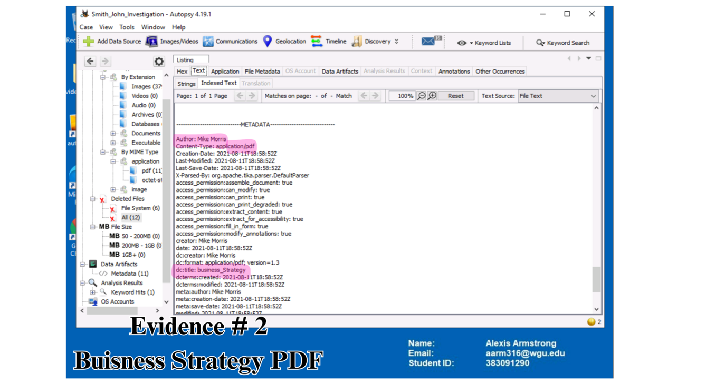 <i>Locating business_strategy.pdf in deleted files</i></td>
    <td align="center"><b>Step 13: Metadata Validation</b> 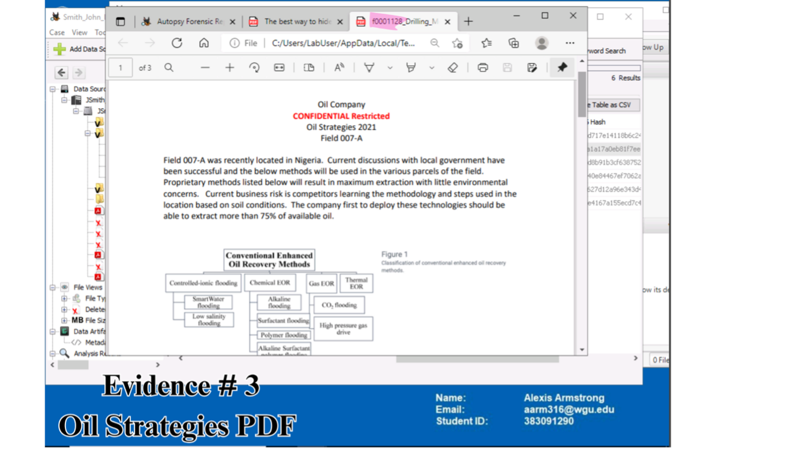 <i>Verifying Mike Morris as authorized owner via metadata</i></td>
  </tr>
  <tr>
    <td align="center" colspan="2"><b>Step 14: Behavioral Analysis (Web History)</b> 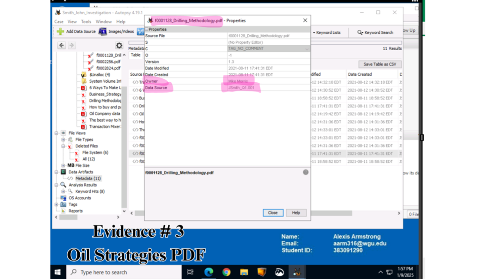 <i>Uncovering Bitcoin searches related to untraceable transactions</i></td>
  </tr>
</table>

## 🔍 Phase 3: Behavioral Investigation & Reporting

* Investigated web browser history, uncovering searches related to "hiding Bitcoin," which flagged potential financial risks or intent to sell sensitive data to competitors.

* Validated the integrity of all collected evidence through SHA-256 hashing and documented the start and progression of unauthorized activities.

* Generated a comprehensive forensic report (Autopsy HTML report) featuring clickable links for non-technical stakeholders in Senior Management and Legal.

* Summarized critical findings and conclusions to support potential legal action regarding the violation of non-disclosure agreements (NDAs)

<table>
  <tr>
    <td align="center"><b>Step 15: Investigative Timeline</b> 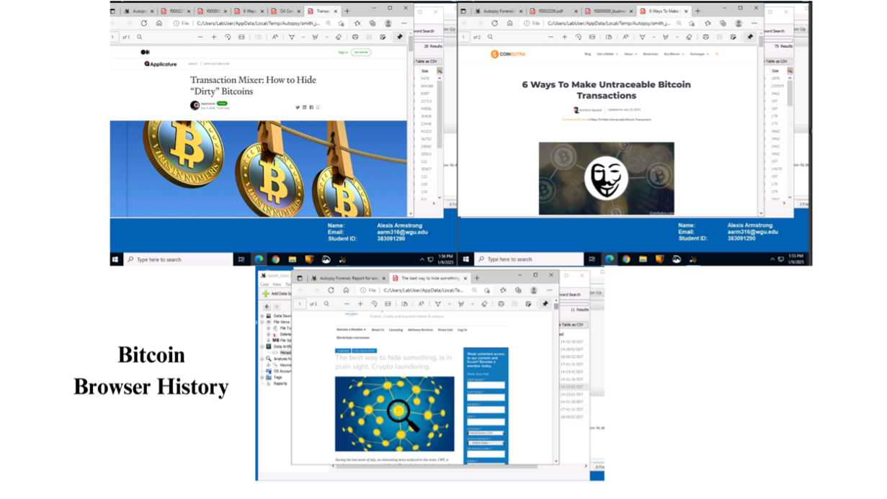 <i>Mapping unauthorized IP access from 8/11/21 to 8/13/21</i> [cite: 286]</td>
    <td align="center"><b>Step 16: Intent Identification</b> 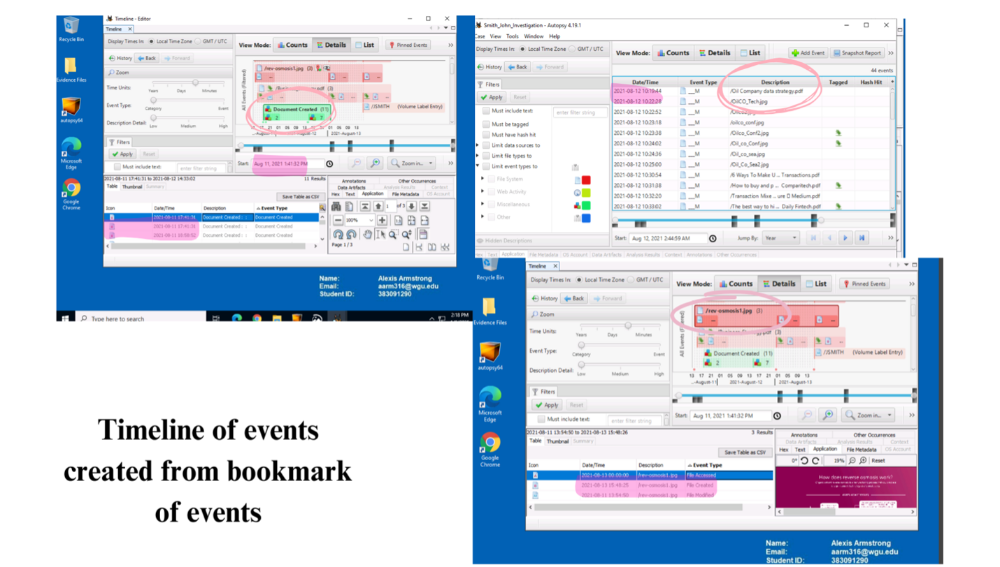 <i>Analyzing Bitcoin browser history for malicious intent</i> [cite: 284]</td>
  </tr>
  <tr>
    <td align="center" colspan="2"><b>Step 17: Final Evidence Tagging</b> 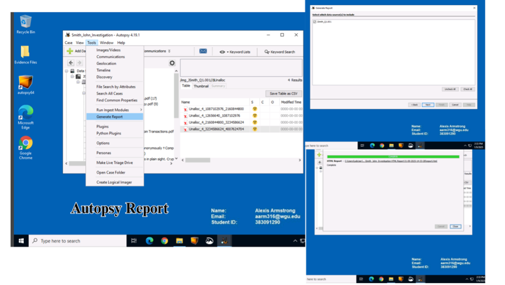 <i>Generating Autopsy report for Senior Management and Legal</i> [cite: 287]</td>
  </tr>
</table>

